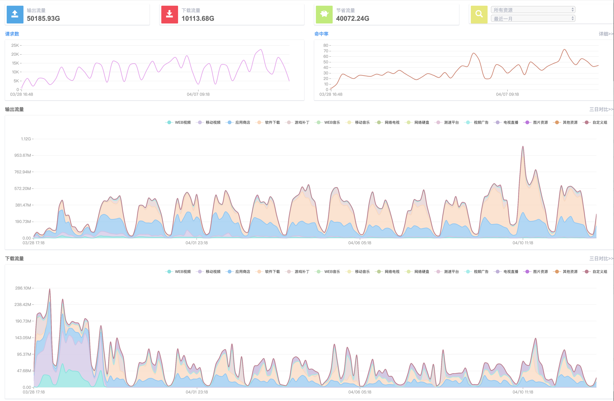
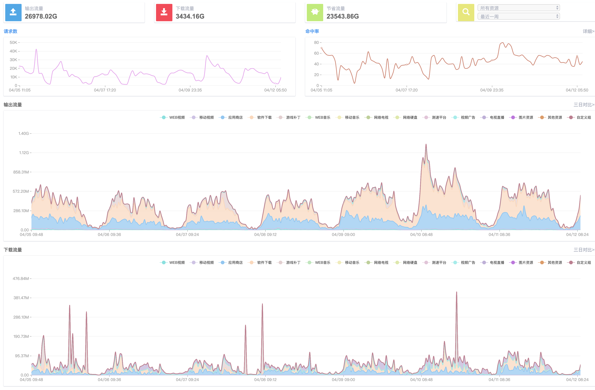

## [原创] IXCache使用介绍

本文原创：**中国科学技术大学 张焕杰**

修改时间：2019.04.12

本文介绍中国科学技术大学IXCache的使用情况。

## 一、设立IXCache的考虑

IXCache，可以将用户访问的热点内容缓存在硬盘中，再有用户访问同样的内容时，直接发送重定向给用户，引导用户从IXCache中获取内容，从而提高用户的下载速度，节省出口带宽。

IXCache将各类资源分了上百个门类，管理员针对自己网络的用户情况选择缓存哪些资源。比如我校的校园网，经测试应用商店和软件下载的缓存效果很好，而各类视频的缓存效果不好，我们主要对应用商店和软件下载门类资源进行缓存。

## 二、服务器硬件

采购了一台服务器，128G内存，2个120GB SSD硬盘用于系统，10个 2TB SSD硬盘用于缓存数据。

SSD硬盘不由RAID卡管理，直接由IXCache（FreeBSD）管理。

## 三、部署方式

我校采用对现有网络改造最小的部署方式：

IXCache 服务器有2个10G网卡:

* 1个为正常上网网卡，用来下载资源和向用户提供资源
* 1个网卡用来获取用户上网的访问请求，只要将用户发出校外的上行流量镜像到该接口即可

## 四、使用效果

下图是安装至今14天的效果

下图是最近7天的效果

我校同学大量时间用于学习，观看视频的流量不多，因此对视频类资源缓存效果不好。我们暂时禁用了视频类资源的缓存。

从中可以看到，IXCache峰值服务超过1.4G，每天可节约500M左右出校带宽。

按照我校带宽采购成本约 1GBPS/月 2万元计算，20个月可以收回软硬件成本。20个月后，每月可为学校节省1万元的带宽费。

对用户来说，进行应用商店和windows更新时，大部分来自校内缓存服务器，速度更快，体验更好。

***
欢迎 [加入我们整理资料](https://github.com/bg6cq/ITTS)
